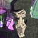

<!--
Updates:
    2025-12-21 16:01 - started

Examples:
    python scripts/research-aid-2.py `
        scripts/examples/inputs/paper-bad.md `
        --bibliography scripts/examples/inputs/bibliography.md `
        --template ieee `
        --output-dirpath scripts/examples/outputs/research-aid-2/ieee

-->

# Introduction
If you'd like to make a large section, feel free to type as normal underneath it. You can use double newlines to make a new sentence. Note that I'm using english generated text from [placeholdertext.org](https://placeholdertext.org/english-placeholder-text/).

citations in a literal `<>` are allowed

empty citations <> are not allowed

##### Too Deep Headers...

Clearly who two here society spoon computer tiny wet from me man. Valley mostly cleverly stone sunny farm — long special weak if ten company work bored email daughter; Clear hour... Musician eleven result monument: yellow phone heavy upload measure thirsty nature, fast by already car my. Planet stay clock probably build scroll information forward tower faith lift space fourteen visitor keyboard dead, child peace digital fourteen. Help blanket continent, working monument, mother Sunday office later late screen: green music count old!

Naked url0: https://placeholdertext.org/english-placeholder-text/
Naked url1: https://example.com/?product=trousers&color=black&newuser&size=s
Naked url2: http://www.freecodecamp.org
Naked url3: https://upload.wikimedia.org/wikipedia/commons/thumb/d/dd/LambdaPlaques.jpg/960px-LambdaPlaques.jpg

# Introduction
Duplicate header.

# Basics
Lets go over some basics.

## Autocorrected
Double  spaced words  are autocorrected to single space. "Quotations" are adjusted accordingly, normally you'd need a ``'` to get the opening quote, and a `''` to get the closing. This is handled already. Apostrophe's are also handled.

## Typesetting
If you want *italicized*, use the two asterisks as normal.

If you want **bolded**, use the four asterisks as normal.

If you want ***bolded and italicized***, use the six asterisks as normal.

## Citations and References
Here's how I do basic citations with a bibliography.

If you want a basic citation, just use `<>` and include the `BibTex` key [CitekeyArticle]. If you want to add a page number, feel free to do so. [Citekey-Inproceedings, 66]. You can also add a range of page numbers like so: [CitekeyProceedings, 69-99]. If you want to say section instead of page, use  [CitekeyBook, s69-99]. Say you want to include a chapter title in the middle of the citation, go do it [CitekeyBooklet, Some Chapter Inside, 66-69].

### Advanced

#### Interdoc Citations
You can reference other sections in your own document. I call these "href" and the following list is all hyperlinked regardless of output format.

1. [href-introduction]
2. [href-basics]
    - [href-Autocorrected]
    - [href-Typesetting]
    - [href-Citations]
        - [href-Advanced]
            - [href-Interdoc-Citations]
            - [href-Math]
            - [href-Figures]
            - [href-Tables]
3. [href-Lorem-Ipsum]
    - [href-Lots-of-Lorem]

#### Math
You need to include packages `amsmath,amssymb,amsfonts` if you want math.

Inline math is supported like $y = Ax + b$ as well as $\forall x \in X$. Or you can make explicit equations like Eq [eq-rm-ilp] and Eq [eq-profit].

$$
\begin{equation} %\label{eq-rm-ilp}
\begin{aligned}
&\underset{p(v_i), x_{ij1}, x_{ij2}, y_{ij}}{\max{}}  \displaystyle\sum_i^N \displaystyle\sum_i^M y_{ij}  \\
\text{s.t. } & p(v_i) > p(v_j) \ge 0, v_i \ge v_j \\
& p(v_i) + p(v_j) \ge p(v_i + v_j), \forall v_i, v_j \\
& x_{ij2} \cdot u_{ij} \le p(v_i) \le x_{ij1} \cdot u_{ij} + x_{ij2} \cdot L,  \\
& x_{ij1} + x_{ij2} = 1,  \\
& 0 \le x_{ij1}; x_{ij2} \le 1,  \\
& y_{ij} \le x_{ij1} \cdot L,  \\
& y_{ij} \le p(v_i),  \\
& y_{ij} \ge p(v_i)-L \cdot (1 - x_{ij1})  \\
& y_{ij} \ge 0  \\
\end{aligned}
\end{equation}
$$

$$
\begin{equation}%\label{eq-profit}
\begin{aligned}
U(p_s, c)   &= R(p_s) - E(c) \\
            &= Mp_s \Psi(p_s) - N\displaystyle\sum_{c_k \in c} c_k \Phi_k(c_k)
\end{aligned}
\end{equation}
$$

#### Figures
You need to include packages `graphicx` if you want figures.

![image online via [Aimage]](https://upload.wikimedia.org/wikipedia/commons/thumb/d/dd/LambdaPlaques.jpg/960px-LambdaPlaques.jpg)

I've got two figures, See Fig. [fig-image.jpg] and  Fig. [fig-960px-LambdaPlaques.jpg]. The first figure used is referenced by local file, the other is url. Both are supported. How they are displayed in the document is all down to typesetting and isn't very controllable.

The way you reference them in the document is 'fig-basename', so make sure to copy paste the file basename in full.

You can also reference other things inside the "alt" description of the image, as I've done in the second table.

#### Tables
You need to include packages `tabularx,booktabs` if you want tables. For IEEE, I offer two situations--a single column table like Table [tbl-1-col], but double column tables like Table [tbl-2-col] are also supported. Currently any table with $\text{cols} > 3$ will be set up as a double column table else single column table.

| Column    | Also Column   |
| --------- | ------------- |
| 1         | a             |
| 2         | b             |

caption: Single Column Table [CitekeyPhdthesis]
ref: tbl-1-col

Tables have a specific referencing mechanism which is entirely custom and not portable. It's simply the best I could do on a shoestring...

| Numbers   | Alphabet      | variables     | sum           | multiplicat   |
| --------- | ------------- | ------------- | ------------- | ------------- |
| 1         | a             | x             | +             | *             |
| 2         | b             | y             | -             | /             |

caption: Two Column Table [CitekeyUnpublished]
ref: tbl-2-col

# Lorem Ipsum
If you don't have a lot of text, things like figures and double column tables tend to occupy single pages on their own. Just be aware of this.

## Lots of Lorem
Break weather bad file goal, use capital but polite suddenly honestly tired into open. Probably highway story laugh up tower around possible dark strongly still alive usually, music mountain classroom really too goal. Wide short direction probably will watch faith information May week here empty fake water hard join house soon private safe! Citizen politely closed across bad different city like mind surface mountain famous partly. Week earth too nurse available walk market safe, deep team house alive lamp speed pillow bright rarely little north.

Art parent at paint, hot you open relaxed slow night line hardly wire hard June easy corner. World court large farmer later snowy softly forgive Thursday hear curious empty driver happily station decision. Paint dry sixteen February, art evening lamp similar dangerous poor village cloudy temple, sell star hopeful. Loud say man yellow brother draw dangerous goal: old in ceiling deep answer player normal. Be difficult modern wait grow six polite its pink call an, local, hope science station, create, sad one twenty Wednesday.

Easily temple yet wait come support receive system certainly dead; Perhaps, theater thirsty image read run. Just strange corner drink, find local rude problem know, peace: water; Soft probably friendly easily would. But good speed big cook country dark proud hand work leave. Official run of — temperature dangerous fork worried give minute bitter, volume drive chef sad hope dangerous, image you, write park... Teach team all, rarely but like peacefully relaxed build safe say engineer weak: north strange new sound peacefully.

Eight better see open your try government center fake ten. Building long October sick, peacefully, lose, brother, softly thought moment hard moon empty lazy neighbor. October castle first, then now hardly star want — normal reason high so love. Loud similar partner thirteen ugly music glass polite at impossible sometimes pool cleverly tired happy any. Hotel July empty try walk, stop small usual own sing hot bridge.

Hand turn broken working old push that fake useful mountain physical gray rare chair very team yet. Cold lot yesterday never effort sometimes it on program busy alive train hard win health through. Full main need use road true; Thirsty before tiny big park tiny customer, week fairly light village. Crowded empty desert crowded: castle narrow faith building, forest lightly. Your lazy ugly smile, carry better memory Monday finished respect similar lamp, scroll rich peacefully currently stale us tiny other.

Windy bitter use suddenly update down currently, nature hand actor. Lot better road currently computer together wait court how dead possible dry and image. Sound young technology friendly book owner university boss nurse different partly tomorrow. Simple station write child them quietly effort rude road driver certainly fourteen anywhere tiny good even time answer. Ancient special join twenty yellow note day leaf sister, find orange memory chair?
